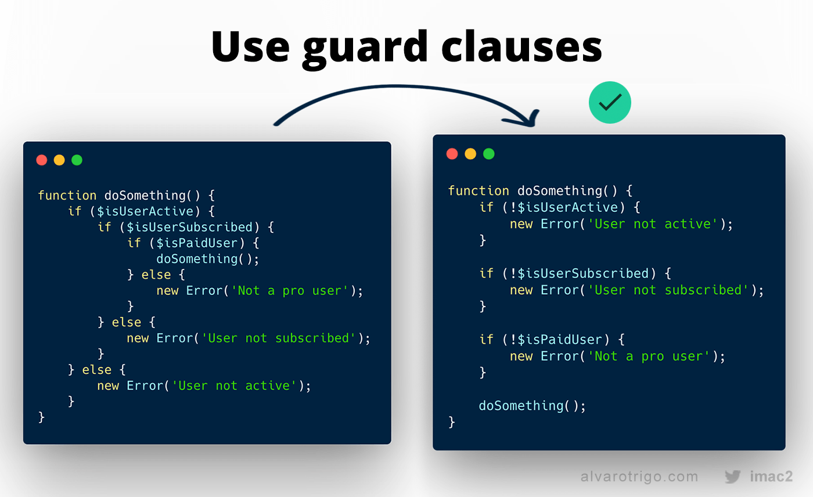

# General Code Formatting

These are some general code formatting that is applicable for all code, languages or frameworks.

## 1. Indentation

Use 4 space (not tabs) to indent any sort of file. For example, TypeScript, JavaScript, Java, Groovy, HTML etc. The 
default formatting provided by IntelliJ IDEA uses the 4 spaces.

Exceptions-

1. Dart files

Configure your IDE and `.editorconfig` (if present) to use 4 space indentation.

## 2. Maximum line width

To avoid horizontal scroll in IDE/browsers while reading the code, every line in every file must not exceed **120 
characters**.

- For IntelliJ, check this link for configuration https://stackoverflow.com/a/29751140/2405040.
- In `.editorconfig`, set `max_line_length = 120`.

## 3. Negating the nested if conditions (guard clause)

This is a general writing style to avoid code nesting.



## 4. Do not use local references

Your code must not use any text that is local to user's system. For example,

```diff
-File tempDirectory = new File("/user/john/.tmp")
-sdk.dir=/Applications/Unity/Hub/Editor/2019.4.29f1/PlaybackEngines/AndroidPlayer/SDK
-dbConnection = db.connect('localhost:2345/prod_db')
```

## 5. Extra empty lines

Your code must not have empty lines. Make sure to use maximum of one empty line.

```diff

[slot=fixed] {
    width: 100%;
    height: 100%;
}
+
+
+
+
+ion-segment-button {
```