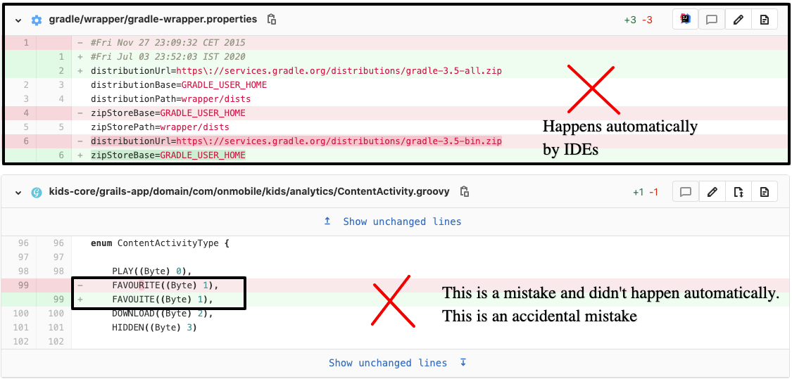
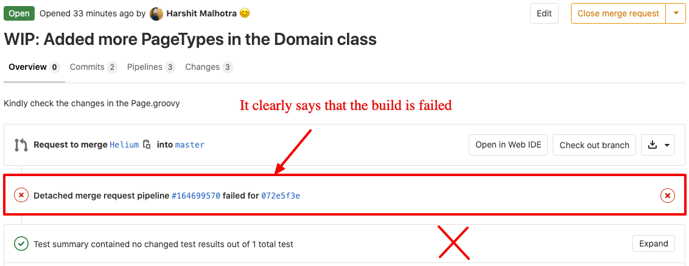
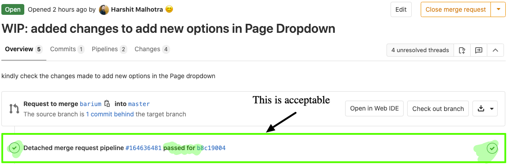

# Steps to take after a Merge Request is created

**These steps must be taken before assigning the merge request for peer review & testing.**

## 1. Self-review



- You must review each and every single line/word/character change in the merge request.
- You must make sure you did those changes.
- If you are not sure about any changes, ask your team or revert the change.

For example, the following changes are wrong in a merge request.

That being said, there are times when certain files are changed automatically. Those are the exceptional cases-

1. When modifying `package.json` in a Node repository, `package-lock.json` are changed automatically.
2. Formatting a file via IDE changes some other lines.

## 2. Resolve merge conflicts

Before requesting someone to review your merge request, make sure that there are no merge conflicts. If there are any, 
resolve them first.

## 3. Verifying the pipeline status

**For GitLab-** After you created the merge request and if there are pipelines (CI/CD) configured, the pipeline 
must pass and result is green. For example, the following MR won't be accepted-

| ❌ | ✅ |
|----|----|
|  |  |
|----|----|

## 4. Code-level general verification

1. Each code change was executed.
2. Each individual character, word, and line that has been changed in this MR was self-reviewed for DRYness & quality.
3. No print statements, unnecessary logs are left in the MR.
4. No commented code are kept in the branch/MR.
5. Code linting are performed i.e. code formatting are optimized as per linting rules.
6. All the general rules of specific language or framework was followed and checked. For example-
   1. [General](../1-general/README.md) rules like code indentation.
   2. [HTML](../6-html/README.md)'s general rules & other standards are followed..

## 5. UI level verification

1. The UI changes were tested in major browsers and application Android & iOS devices.
2. User facing texts are checked for typos & grammar mistakes.
3. The screenshots of modified/new screens must be attached.

## 6. MR Title

1. The MR must have a descriptive title.
2. **It must not be the name of your branch**.
3. **It must not be your first commit**.
4. The title must start with the Jira number. For example- `COOEE-123 Added user login endpoint`

```diff
- login endpoint
+ Added login endpoint

- fix: Add login endpoint
+ COOEE-123 Added user login endpoint
```

## 7. Code based test cases

1. Unit & integration test cases of modified code have been added which covers edge case scenarios.
2. All test cases pass (if running locally).

## 8. Highlight

You must highlight the followings in your MR or Jira card-

1. Any fix, feature or task which was not covered as per the expectation.
2. Any potential threat or security issue that was not covered.
3. Any edge case scenario you discovered during the development.

## 9. Testing performed

In the MR comment, you must add all the testing you have performed in bullet points. For example-

```html
Tests conducted-

1. Login endpoint is accepting POST request.
2. User existence is checked before performing the request.
3. Password validation is performed before signup.
4. Locked accounts are not allowed to login.
5. User signup is not broken because of user login.
6. Any other code related to login (like profile display endpoint) is not effected.
```

These tests must be re-performed after each time you re-assign your MR for consecutive reviews.

## 10. After you are done with all the above-

1. Resolve Draft status in GitLab MR.
2. Leave a comment in the MR itself that the MR is ready for review.
3. Notify your peer for review (you can mention in the comment).
