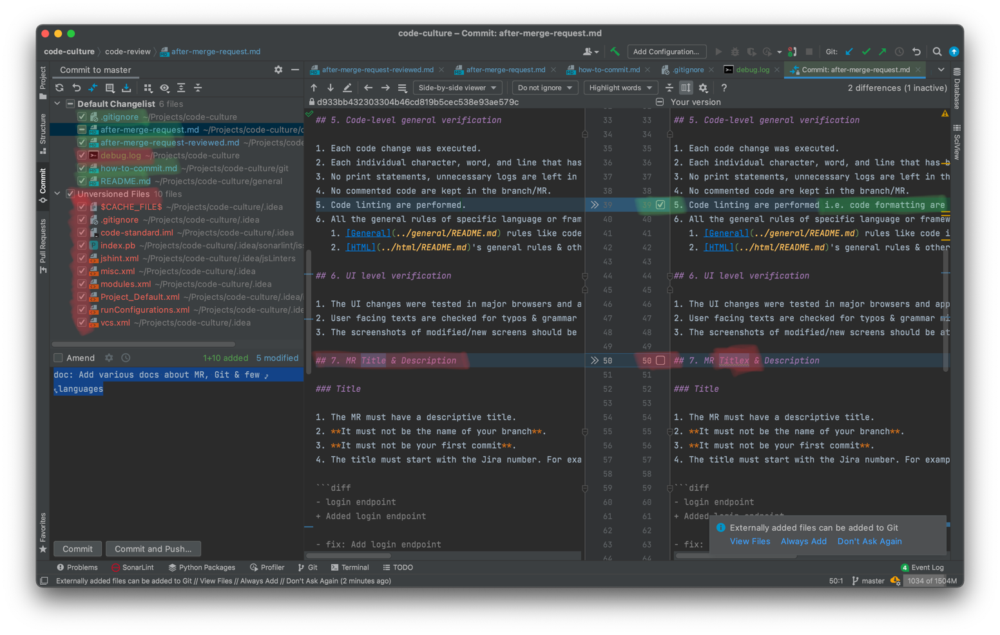

# How to Commit

Follow these commit guidelines for each & individual commits.

## 1. Be Specific

Your one commit must have changes for only one task/feature/bug/improvement. For example, your commit must not 
have changes for two bug fixes even if those are one word changes.

Another example, one commit must have changes for forgot password fix only but should not have a change for adding a 
new email OTP feature in the forgot password feature.

## 2. Golden Rule

**DO NOT BLINDLY COMMIT VIA `git commit -a`**.

## 3. Review before commit

You must review **each character** change in **each files** you are about to commit. Look at the below example-

1. Make sure you are not committing unversioned files if these files/directories are-
   1. Auto generated files.
   2. Temporary files.
   3. You didn't create.
   4. You are not sure about.
2. You must not commit any accidental change in the code.

## 4. Commit frequency

1. If you are working on a new feature or task that takes you hours or days, you must do the commits frequently (at 
   least twice a day) so that you can look back into the entire journey of getting that feature code ready.
2. If you are working on something that involves trying different approaches (trial-n-error), you must commit each 
   attempt or each approach.

## Commit message
   
Read about commit messages in [how-to-write-commit-message.md](./4-how-to-write-commit-message.md).