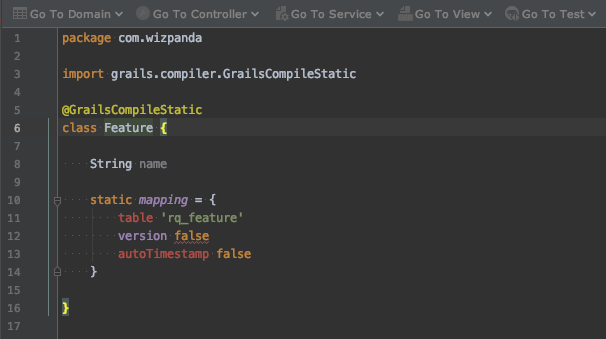
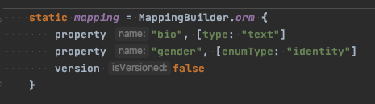

# Best Practice 4: Use of `MappingBuilder` in Grails domain classes

Our code needs to be [strictly typed](https://en.wikipedia.org/wiki/Strong_and_weak_typing). But when using Grails, some of the code are
 not strictly typed. For example-
 
1. `createCriteria` or `withCriteria` code.
2. `mapping` block in domain classes.

Since we are looking into the best practices of a Grails domain class, let's discuss the 2nd point. For an example-

```groovy
@GrailsCompileStatic
class User {

    static constraints = {
        gender nullable: true
    }

    static mapping = {
        bio type: "text"
        gender [enumType: "identity"]
        version false
    }

    String bio
    Gender gender
}
```

When you see this code (which is having `@GrailsCompileStatic`) in IntelliJ, it will not be able to figure out the types in the `mapping`
block. And because of a bug in IntelliJ, it will show errors only in the IDE (not when you run the app). See the descriptions at 
https://stackoverflow.com/q/60113220/2405040



To overcome this problem, we need to use the `MappingBuilder` class which is used internally by Grails. So the modified version will look
 like this-

```groovy
import grails.gorm.hibernate.mapping.MappingBuilder

@GrailsCompileStatic
class User {

    static constraints = {
        gender nullable: true
    }

    static mapping = MappingBuilder.orm {
        property "bio", [type: "text"]
        property "gender", [enumType: "identity"]
        version false
    }

    String bio
    Gender gender
}
```

Now IntelliJ can represent your classes better.


